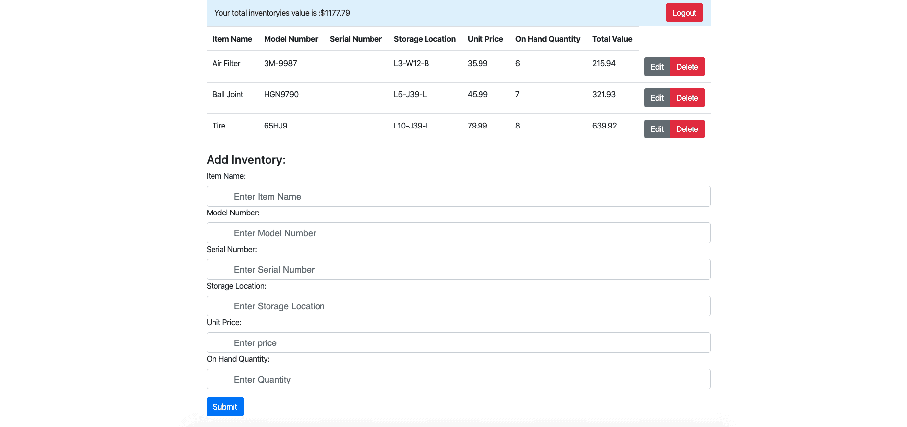

# Project3 Warehouse Management Application

## Table of Contents

- [About the Project](#About-the-project)
- [Getting Started](#Getting-started)
- [Usage](#Usage)
- [Contacts](#Contacts)
- [License(s)](<#License(s)>)

## About the Project

Project3 is a MERN stack Warehouse Management Application that helps users tracking the inventory storage locations and monitoring values. Application consolidates authentication to verify the user's credential and utilizes get, put, post and delete function to interact with back-end database.  

## Getting Started

This project is hosted by heroku, simply click the URL link [Launch Hosted Application!](https://gen-warehouse-app.herokuapp.com/ "Launch Project 3") and create a login with an e-mail,name and password.

## Usage

Upon arriving on the ladning page, the user will be reqired to sign in. Sign up option are reqired for first time user. To do so, simply input a valid e-mail address,name and password, then click the `Sign Up` button.

Sign in Page 

If you are the first time user. Please click sign up botton and register with a valid e-mail,name and password, then click the `Signup` button.

Sign up Page 

Once Signed in, the user can add, edit and delete the inventories and the total value for all inventories will displayed on top of the page.

Warehouse Page 

## Contacts

- Gen Li
  - GitHub: [regan035](https://github.com/regan035 "regan035's GitHub")
  - LinkedIn: [www.linkedin.com/in/genli](https://www.linkedin.com/in/genli/ "https://www.linkedin.com/in/genli/")
  - e-mail: regan035@gmail.com

## License(s)

- [ISC](https://opensource.org/licenses/ISC)

